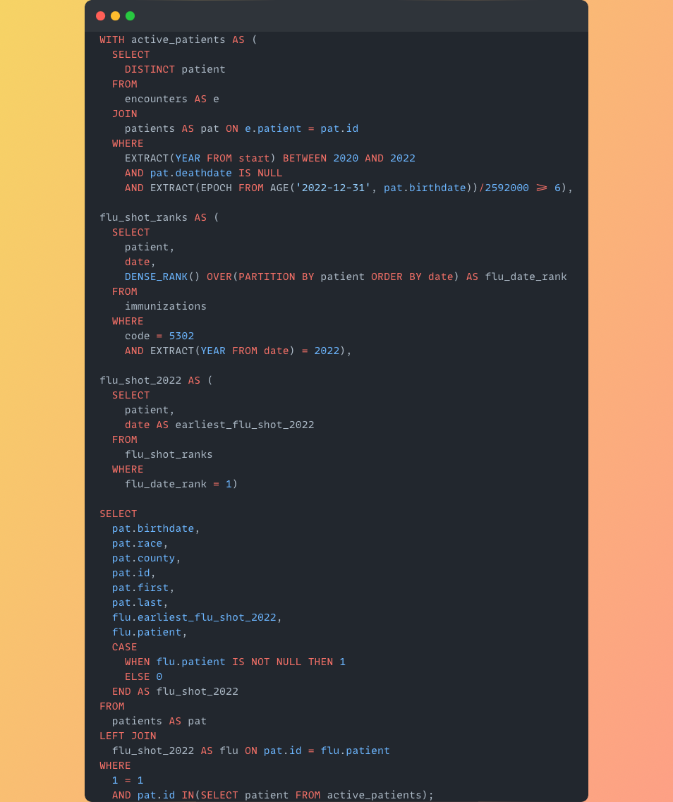

# Immunizations Flu Shots 2022

## Introduction
The dataset used in this analysis contains healthcare data from the state of Massachusetts, specifically focusing on selected counties. The objective is to identify patients aged 6 years or older who are eligible to receive flu shots and to determine how many of these patients have received their flu shot immunization in the year 2022. The analysis aims to provide insights into flu vaccination rates among eligible patients within these counties, aiding clinicians to ensure follow-up with active patients.

## Objectives
### Come up with flu shots dashboard for 2022 that does the following:
<ol>
  <li>Total % of patients getting flu shots stratified by <ul>
    <li>Age</li>
    <li>Race</li>
    <li>County (on map)</li>
    <li>Overall</li>
  </ul></li>
  <li>Running total of flu shots over the course of 2022</li>
  <li>Total number of flu shots given in 2022</li>
  <li>A list of Patients that show whether or not they received the flu shots</li>
</ol>

Skills applied: JOIN, Window Functions, Common Table Expressions (CTE), Date Functions, and CASE Statement

## SQL Query
</img>

### Filtering Active Patients:
- Define the criteria for active patients: patients who have had encounters at a hospital between 2020 and 2022, are alive, and are at least 6 years old (eligible for the flu shot).
Apply the criteria to filter the active patients from the dataset.

### Ranking Flu Shot Dates:
- Use the DENSE_RANK() function to rank the flu shot dates for each patient in 2022, ensuring that the latest date is ranked first.

### Identifying Latest Flu Shot Date:
- Extract the latest flu shot date for each patient in 2022 based on the ranking.

## Visualizations
</img>
### Dashboard Components

#### Flu Shot by Age (%):
- A bar chart showing the percentage of patients who have received flu shots in 2022, segmented by age groups (e.g., 6-10 years, 11-20 years, etc.)

#### Flu Shot by Race (%):
- A bar chart showing the percentage of patients who have received flu shots in 2022 based on racial categories (e.g., White, Black, Hispanic, etc.)

#### Flu Shot by County (%):
- A map illustrating the percentage of flu shot recipients in 2022 across different counties in Massachusetts

#### Flu Shot List:
- A tabular representation of patients who have received flu shots in 2022, including patient name, age, race, and a color to represent whether or not the patient received the flu shot

#### Running Sum of Flu Shots 2022:
- A line chart tracking the cumulative number of flu shots administered in 2022 over time, providing a visual trend of vaccination efforts

#### Total Compliance (%):
- Indicating the overall compliance rate of flu shots among eligible patients in 2022

#### Total Flu Shots Given:
- A numerical representation of the total number of flu shots administered in 2022

These visualizations are created in Tableau and can be found here: <a href = "https://public.tableau.com/app/profile/alejandro.de.la.cruz5286/viz/ImmunizationsFluShots2022_16969790052040/Dashboard1" target = "_blank">Immunizations Flu Shots 2022 Dashboard</a>

## Results

